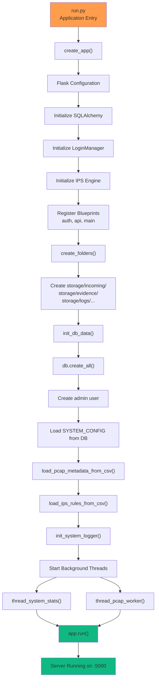
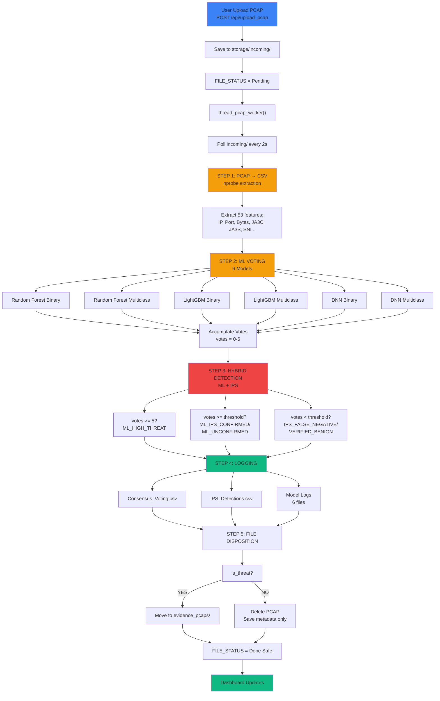
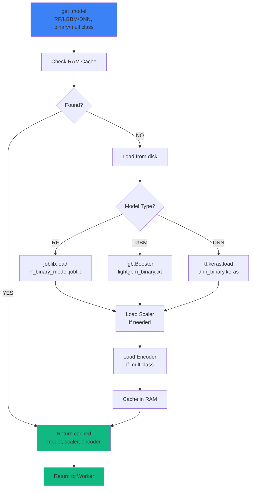
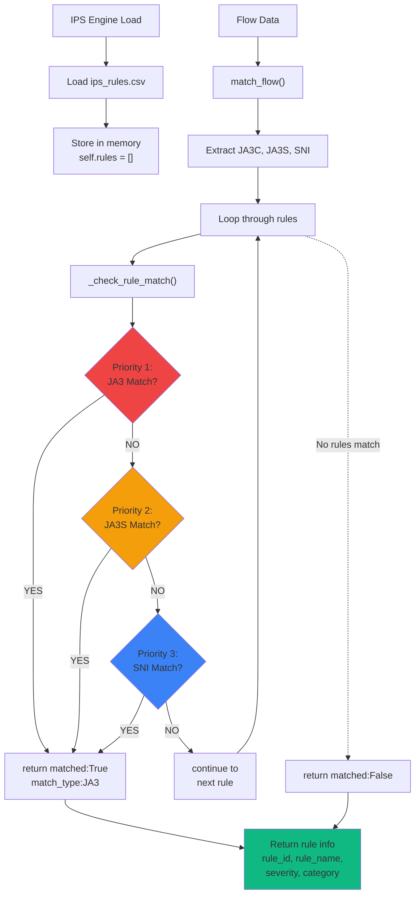
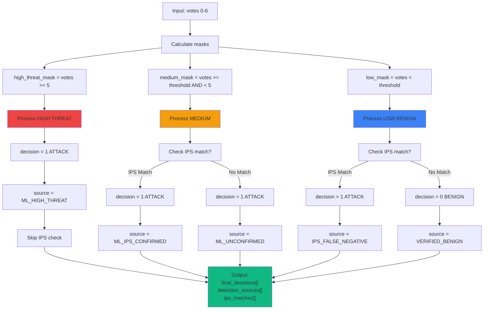
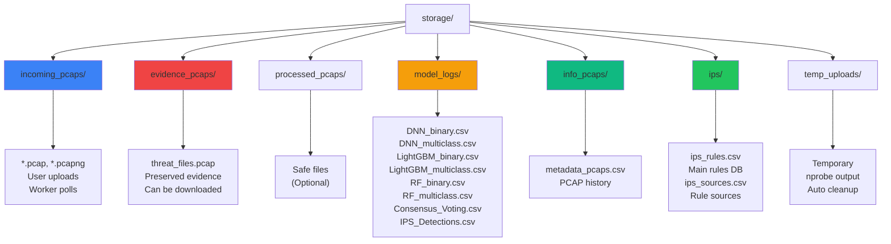
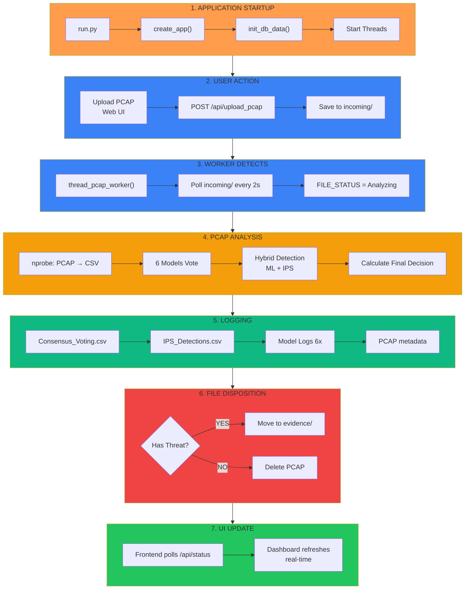
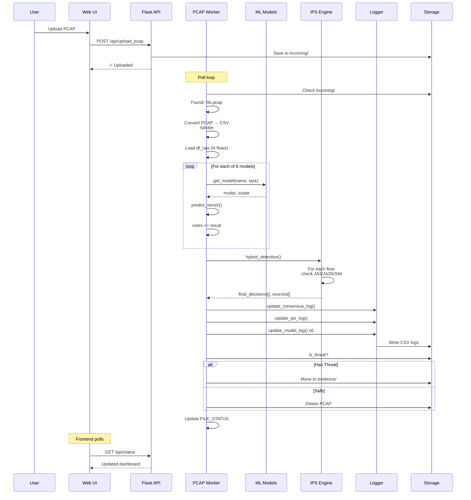
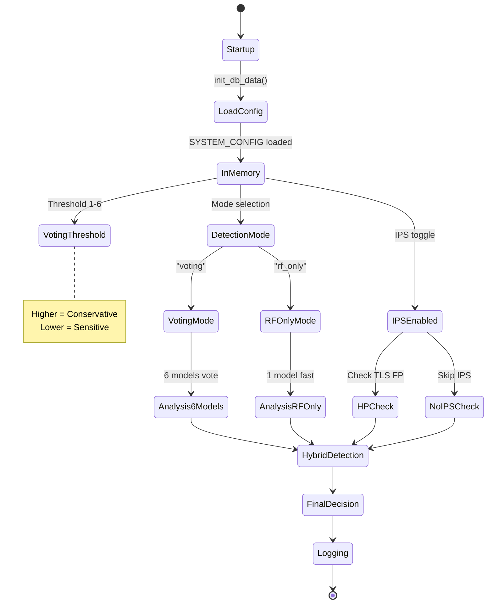

# NIDS Fabric - Project Architecture (Mermaid Diagrams)

## 1. APPLICATION STARTUP FLOW

---

## 2. PCAP ANALYSIS PIPELINE

---

## 3. ML ENGINE - MODEL CACHE SYSTEM

---

## 4. IPS ENGINE - TLS FINGERPRINT MATCHING

---

## 5. HYBRID DETECTION LOGIC

---

## 6. API LAYER - ENDPOINTS

```mermaid
graph TD
    subgraph SYSTEM["System & Status"]
        A["GET /api/status"]
        B["GET /api/history"]
        C["GET /api/system-settings"]
        D["POST /api/system-settings"]
    end
    
    subgraph FILES["File Management"]
        E["GET /api/incoming-files"]
        F["POST /api/upload_pcap"]
        G["POST /api/delete-file"]
        H["POST /api/delete-evidence-pcap"]
    end
    
    subgraph LOGS["Logs & Analysis"]
        I["GET /api/get_flows"]
        J["GET /api/get_consensus_logs"]
        K["GET /api/ips-logs"]
        L["GET /api/logs/summary"]
    end
    
    subgraph IPS["IPS Management"]
        M["GET /api/ips-rules"]
        N["POST /api/ips-rules/add-ja3"]
        O["POST /api/ips-rules/import-file"]
        P["DELETE /api/ips-rules/<id>"]
        Q["GET /api/ips-sources"]
        R["POST /api/ips-sources"]
    end
    
    A -.-> |CPU/RAM/Flows| Dashboard
    E -.-> |PCAP List| Dashboard
    I -.-> |Detection Logs| Dashboard
    M -.-> |IPS Rules| Dashboard
    
    style Dashboard fill:#10b981
```

---

## 7. STORAGE STRUCTURE

---

## 8. COMPLETE FLOW SUMMARY

---

## 9. DATA FLOW - SINGLE PCAP PROCESSING

---

## 10. SYSTEM CONFIGURATION STATE

